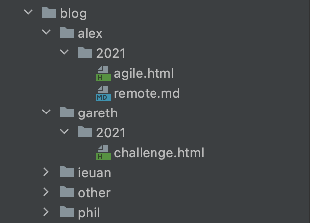

<p align="center">
  
</p>

<p align="center">
  <a href="#introduction">Introduction</a> •
  <a href="#local-installation">Local Installation</a> •
    <a href="#how-to-add-a-blog-post">How to add a blog post</a> •
  <br>
</p>


## Introduction

This project is for the legal innovation lab wales developer page. The site includes:
* Blogs
* Documentation
* Projects
* Guides for workflows

The website is currently live at [developer.legaltech.wales](https://developer.legaltech.wales)

---

## Tech Stack and Requirements

The core technologies used for this project are:

* Ruby (2.7.2) (we recommend using rbenv for managing Ruby versions)
* Jekyll

---
## Local Installation
Follow these instuctions for local installation:

### Install dependencies

Install Gems

`bundle install`


### Run the application

`jekyll s`

You should now be able to view the main web page at

``http://localhost:4000``

### Other Potential Fixes


You might need to manually install Jekyll on your system with:
```
gem install jekyll
```

Further information about jekyll can be found [here](https://jekyllrb.com/docs/installation/)

---


## How to add a blog post

###Local

To add a blog post locally, your post must be formatted in either [markdown](https://daringfireball.net/projects/markdown/) or [html](https://www.w3schools.com/html/).

Navigate to the local blog folder and create a user & year if it doesn't already exist. Next, add your .html or .md file to the folder.



Make sure the file is formatted to the correct standard so it can be rendered properly. Look at the other existing blogs
for examples of how to format or lookup the guides for  [markdown](https://daringfireball.net/projects/markdown/) / [html](https://www.w3schools.com/html/).

The start of the file will need to include some yml at the top of the file such as this

```angular2html
---
layout: blog
author: Alex
full-name: Alex W
short-title: agile
full-title: Agile Working
file-type: html
publish-date: January 20
publish-year: 2021
card-color: green
---
```

Finally, you will need to copy the same information and add it too blogposts.yml file under dev-page/_data.

### Publishing the post live.
Once you have checked your post works on your local site and you have checked you can navigate to it.  Then you can submit
a pull request to this repository. The post will be then be reviewed.